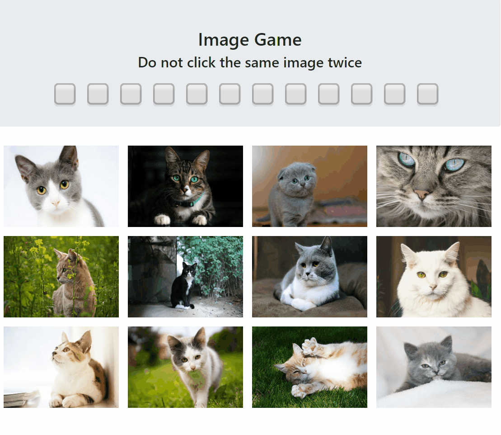

## Image Game

Using react as the framework, I created a game that tests users memory skills by having them pick no image twice while the order shifts after every click.

### Deployment

1. Node.js must be installed to use npm commands.
2. Run "npm install" on command line
3. Run "npm start" after installation and see what happens!

